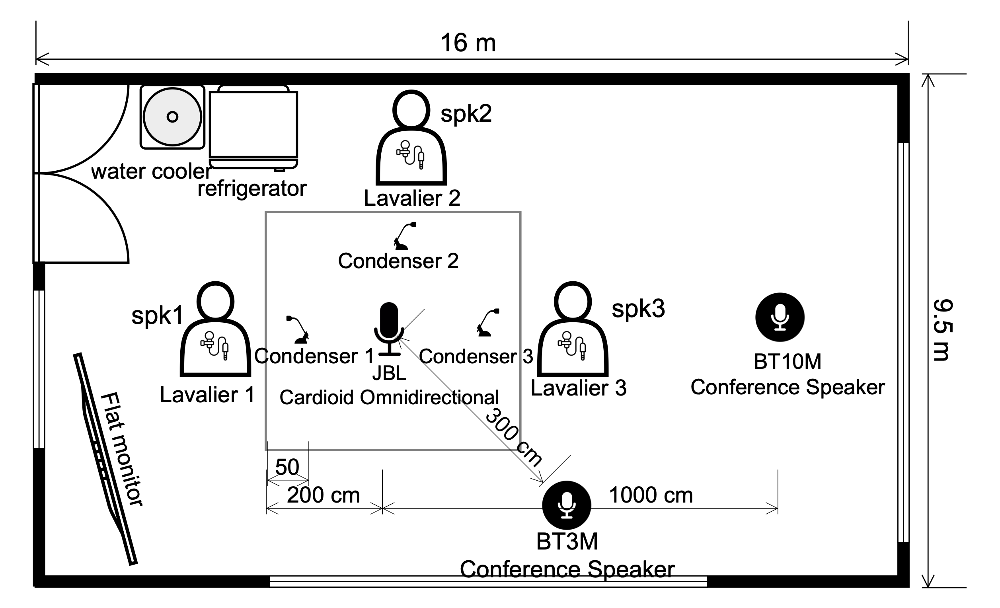
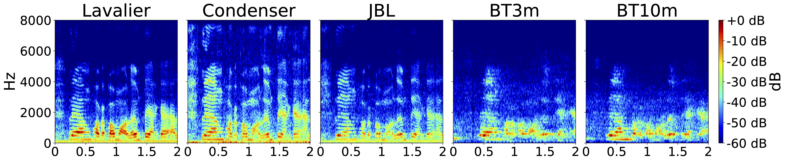

# LOTUSDIS: A Thai Far‑Field Meeting Corpus for Robust Conversational ASR


[](https://creativecommons.org/licenses/by-sa/4.0/)
[](https://arxiv.org/pdf/2509.18722)


LOTUSDIS is a Thai non‑array meeting corpus designed for far‑field transcription in realistic office conditions. It contains **~114 hours** of multi‑channel speech (≈20 hours unique session time) recorded in **15–20‑minute** sessions with **3 speakers** each. **Nine single‑channel devices** capture audio from near‑field to 10 m, preserving device and room effects (HVAC, water cooler, etc.). We provide train/dev/test splits and baseline ASR benchmarks.

> **License:** CC‑BY‑SA 4.0. 


---
## Introduction

**LOTUSDIS** is a **Thai far-field meeting corpus** created to advance research in robust **conversational automatic speech recognition (ASR)**. The dataset comprises **114 hours** of spontaneous, unscripted dialogue recorded in a realistic office environment using **nine independent single-channel microphones** placed at distances from **0.12 m to 10 m**.

🗣️ **Realistic Conversational Speech**  
Captures natural, overlapping multi-speaker discussions among 86 participants across diverse topics, providing a true reflection of Thai conversational dynamics in real meetings.

🎙️ **Distance-Diverse Acoustic Design**  
Simultaneous recordings from near-field and far-field microphones (`lav123`, `con123`, `jbl`, `bt3m`, `bt10m`, etc.) preserve the authentic effects of reverberation, noise, and device coloration—essential for studying distance-robust ASR models.

📊 **Rich Annotations and Metadata**  
Includes time-aligned **TextGrid** and **CSV** transcripts, overlap masks, speaker IDs, and device coordinates, supporting detailed analysis for ASR, diarization, and speech enhancement research.

⚙️ **Reproducible Baselines**  
Provides standard **train/dev/test** splits and **Whisper-based Thai ASR baselines**, including fine-tuned models and front-end enhancement comparisons, enabling reproducible benchmarking and fair evaluation.

🔊 **Ethically Collected and Openly Licensed**  
Recorded under **Human Research Ethics Committee approval** with informed consent.  
All personally identifiable information has been removed, and the corpus is released under the **CC-BY-SA 4.0** license for academic and commercial use.

---
  
## Overview
- Language: **Thai**
- Domain: **Conversational, multi‑speaker, far‑field**
- Duration: **~114 h** (≈88 h train / 12.8 h dev / 13.3 h test)
- Speakers: **86** (age 19–48; spontaneous conversation with overlap)
- Setting: **Furnished office** (16×9.5×2.7 m). Stationary noise sources active.


## Device layout & splits
Nine single-channel devices (examples): `lav123` (~12–15 cm), `con123` (~0.5 m), `jbl` (~2 m), `bt3m` (3 m), `bt10m` (10 m).  

**Microphone arrangement inside the recording room:**

<p align="center">
  
</p>

<p align="center">
  
</p>


## 🎧 Audio Samples

Listen to short LOTUSDIS examples directly on this page.

### Example 1 — bt3m (3 m distance, far-field)
<audio controls>
  <source src="data/sample/bt3m_example.wav?raw=1" type="audio/wav">
  Your browser does not support the audio element.
</audio>

### Example 2 — lav123 (near-field)
<audio controls>
  <source src="data/sample/lav123_example.wav?raw=1" type="audio/wav">
  Your browser does not support the audio element.
</audio>


## Download
### Getting the data
- **Utterance-level audio file (train,dev,test split)**

  [📥 Train Set (~9GB)](https://drive.google.com/file/d/1tsZ-Qlzur80dUmYevt2d71KV5nRFdHGx/view?usp=sharing)
  
  [📥 Dev Set (~1.3GB)](https://drive.google.com/file/d/1uxu6QCQAWrP7BYgVWZyBUuWtQNwaZ3xP/view?usp=sharing)

  [📥 Test Set (~1.3GB)](https://drive.google.com/file/d/1S7nv9H41sRgYBRA_17bv31hfMqF0vdex/view?usp=sharing)

  


### Annotation files
- **Utterance-level annotation CSV**  
  [📥 Download annotation CSV](https://drive.google.com/file/d/1ut44pgT1tJRd30clNp-IPx6nJiW7co-z/view?usp=sharing)
- **Praat TextGrid annotations**  
  [📥 Download TextGrid (.zip)](https://drive.google.com/file/d/14fMv_X_8sGDPGbnU-hpJ85Mug43AHlgO/view?usp=sharing)


# LOTUSDIS Results

## Key takeaways
- **Fine‑tuning on in‑domain LOTUSDIS** cuts **overall WER from 64.3% → 38.3%**.
- On **far‑field** microphones, fine‑tuning reduces WER **81.6% → 49.5%**.
- WER increases with **distance** and **overlap** (2‑ and 3‑speaker).

## Overall (Pathumma Whisper)
| Model | Training | Eval subset | WER (%) |
|------|----------|-------------|---------|
| Pathumma Whisper | zero‑shot | all | **64.3** |
| Pathumma Whisper | fine‑tuned on LOTUSDIS | all | **38.3** |
| Pathumma Whisper | zero‑shot | far‑field only | **81.6** |
| Pathumma Whisper | fine‑tuned on LOTUSDIS | far‑field only | **49.5**


## Cite
```
@misc{tipaksorn2025lotusdisthaifarfieldmeeting,
      title={LOTUSDIS: A Thai far-field meeting corpus for robust conversational ASR}, 
      author={Pattara Tipaksorn and Sumonmas Thatphithakkul and Vataya Chunwijitra and Kwanchiva Thangthai},
      year={2025},
      eprint={2509.18722},
      archivePrefix={arXiv},
      primaryClass={cs.CL},
      url={https://arxiv.org/abs/2509.18722}, 
}
```
## Human Research Ethics and IRB Approval

All LOTUSDIS data were collected under approved human-research protocols.
The study received Institutional Review Board (IRB) approval Human Research Ethics Committee  before participant recruitment and recording.
Every participant provided written informed consent for recording, transcription, and data release under the CC-BY-SA 4.0 license, with all personally identifiable information removed or anonymized prior to publication.
The dataset contains no sensitive personal data and complies with Thai and international research ethics standards for human-subject audio corpora.
